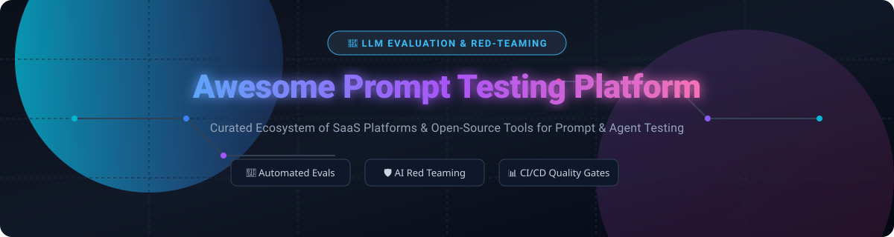

  
  
  
  
  

  

# 🧪 Awesome Prompt Testing Platform 🚀

## 🌟 Top LLM & Prompt Evaluation Ecosystem (SaaS & Open-Source)

> **The definitive curated list of SaaS platforms, LLM evaluation tools, prompt testing frameworks, red-teaming security scanners, datasets, metrics, and CI/CD quality gates for enterprise AI applications.** ⚡

**Last updated: September 2026** 📅

---

This repository tracks top **SaaS platforms** and **open-source projects** for **Prompt Testing**, **LLM Evaluation**, and **AI Agent Observability**. These industry-leading tools help software engineers, prompt engineers, and AI developers systematically evaluate prompts, AI agents, RAG (Retrieval-Augmented Generation) pipelines, and LLM outputs with automated metrics, human-in-the-loop feedback, automated red-teaming, and regression testing in CI/CD pipelines. 🛠️

### 💡 Why Prompt & LLM Evaluation Matters
* **Automated Quality Gates:** Prevent regression in LLM outputs before deploying code to production. 🛡️
* **AI Security & Red Teaming:** Detect prompt injections, jailbreaks, data leakage, and hallucination risks automatically. 🔒
* **Metric-Driven Optimization:** Benchmark precision, recall, faithfulness, context relevancy, and custom LLM-as-a-judge metrics across models (OpenAI GPT-4o, Anthropic Claude, Google Gemini, Llama 3). 📊

---

## 📑 Table of Contents

- [🏢 SaaS / Hosted Platforms](#-saas--hosted-platforms)
- [🔓 Open-Source GitHub Projects](#-open-source-github-projects)
- [🛠️ How to Contribute](#%EF%B8%8F-how-to-contribute)
- [⚠️ Disclaimer](#%EF%B8%8F-disclaimer)
- [📈 Star History](#-star-history)

---

## 🏢 SaaS / Hosted Platforms

### 📊 Industry Market Analysis & Landscape Dynamics
* **Estimated Sector Market Size:** The LLM Evaluation, Observability & AI Reliability market is estimated at **$1.8 Billion - $2.4 Billion (2026)**, growing at a rapid CAGR of >38% alongside enterprise generative AI deployment. 📈
* **Market Structure & Fragmentation:** The sector is **moderately fragmented**. While foundational platforms (LangSmith, Braintrust, Galileo) hold strong developer mindshare, no single "winner-take-all" platform exists yet due to distinct workflows between offline evaluation/red-teaming (e.g., Promptfoo, DeepEval) and online real-time production tracing/observability (e.g., Helicone, Langfuse, Phoenix). ⚖️

> **Sorted by Company Size / Valuation / Funding (Descending)** 👑

| Platform | Description | Size / Valuation / Revenue | Starting Tier Price | Free Tier / Trial Limits |
| :--- | :--- | :--- | :--- | :--- |
| **[LangSmith](https://www.langchain.com/langsmith)** 🦜 | LangChain’s platform for tracing, evaluation, datasets, and prompt experimentation tightly integrated with LangChain/LangGraph. | **$1.3 Billion** Valuation ($260M raised, $16M ARR) | $39/seat/month (Plus plan) | Free Developer plan (5,000 traces/mo, 1 seat, 14-day retention) |
| **[Braintrust](https://www.braintrust.dev/)** 🧠 | Evaluation-first platform for datasets, scoring, experiments, and production monitoring of LLM applications. | **$800 Million** Valuation ($121M raised, Series B) | $249/month (Pro plan) | Free Starter plan (1 GB data/mo, 10k scores/mo, 1M trace spans, 14-day retention, $10/mo model credits) |
| **[Galileo](https://www.galileo.ai/)** 🔭 | LLM evaluation and observability platform focused on quality, hallucination detection, and production insights. | **$450 Million+** Est. Valuation ($68M raised, 834% ARR growth) | $100/month (Pro plan billed annually) | Free plan (5,000 traces/mo, unlimited users and custom evaluations) |
| **[Promptfoo](https://www.promptfoo.dev/)** 🛡️ | Leading open-source LLM evaluation and red-teaming tool with cloud options; supports declarative configs and CI/CD integration (Acquired by OpenAI). | **$86M - $119M** Valuation ($23M raised, Acquired by OpenAI) | $50/month (Team plan) | Free forever (100% free open-source CLI/core; Cloud free tier for individuals) |
| **[DeepEval / Confident AI](https://www.confident-ai.com/)** 🎯 | Open-source evaluation framework (DeepEval) with a commercial platform (Confident AI) for metrics, CI gates, and production monitoring. | **$25 Million+** Est. Valuation (Ventured-backed) | $19.99/user/month (Starter plan) | Free Forever plan (2 seats, 1 project, 5 test runs/week, 1 GB trace data/mo, 7-day retention) |
| **[Langfuse](https://www.langfuse.com/)** ⚡ | Open-source LLM engineering platform with strong evaluation, datasets, experiments, and tracing (Acquired by ClickHouse). | **$20M - $30M** Valuation ($4.5M raised, Acquired by ClickHouse) | $59/month (Team plan) | Free Hobby Cloud plan (50,000 units/mo, 2 users, 30-day retention) or unlimited self-hosted OSS |
| **[Helicone](https://www.helicone.ai/)** 🚁 | LLM observability platform that supports logging and analysis useful for prompt performance evaluation (Acquired by Mintlify). | **$10M - $15M** Valuation (~$1M ARR, Acquired by Mintlify) | $79/month (Pro plan) | Free Hobby plan (10,000 requests/mo, 1 GB storage, 7-day retention, 1 seat) |
| **[Agenta](https://agenta.ai/)** 🤖 | Open-source LLMOps platform focused on prompt engineering, evaluation, and collaboration. | **$5M - $10M** Est. Valuation (Y Combinator backed) | $49/month (Pro plan) | Free Hobby Cloud plan (5,000 agent runs/mo, 2 team members) or unlimited self-hosted OSS |
| **[PromptLayer](https://www.promptlayer.com/)** 🍰 | Prompt management and evaluation platform with versioning, logging, and testing capabilities. | **$5M+** Est. Valuation (Seed funded) | $49/month (Pro plan) | Free plan (2,500 requests/mo, 10 playground runs/day, 10MB dataset storage) |
| **[PromptPerfect](https://promptperfect.jina.ai/)** ✨ | Tools aimed at optimizing and testing prompt quality across multiple LLM models. | **$3M - $5M** Est. Valuation (Bootstrap/Jina AI ecosystem) | $9.50/month (Standard plan) | Free plan (20 initial signup credits / up to 3 prompts/day) & 3-day free trial on paid plans |
| **[Humanloop](https://humanloop.com/)** 🔄 | Enterprise prompt engineering and evaluation platform (Note: platform sunset announced Sept 2025). | Acquired / Sunset | Custom / Enterprise | Free trial (2 team members, 50 eval runs, 10,000 logs/mo) |
| **[Ragas](https://docs.ragas.io/)** 📚 | Open-source RAG evaluation framework often paired with commercial or self-hosted observability tools. | Open-Source Core | Open-Source / Self-Hosted | Free forever (100% open-source Python framework; self-hosted limits depend on infrastructure) |

---

## 🔓 Open-Source GitHub Projects

> **Sorted by GitHub Stars (Descending)** ⭐

- **[Langfuse](https://github.com/langfuse/langfuse)**  ⚡  
  Open-source LLM observability and evaluation platform with datasets, experiments, LLM-as-a-judge, and prompt-linked scoring.

- **[Arize Phoenix](https://github.com/Arize-ai/phoenix)**  🔥  
  Open-source observability and evaluation toolkit for LLM, RAG, and embedding workflows with automated evaluations and tracing.

- **[Ragas](https://github.com/explodinggradients/ragas)**  📚  
  Open-source framework specifically designed for evaluating Retrieval-Augmented Generation (RAG) pipelines with reference-free and reference-based metrics.

- **[DeepEval](https://github.com/confident-ai/deepeval)**  🎯  
  Open-source Python evaluation framework with research-backed metrics, pytest integration, unit-test style LLM testing, and CI/CD quality gates.

- **[EleutherAI LM Evaluation Harness](https://github.com/EleutherAI/lm-evaluation-harness)**  🧪  
  A framework for algorithmic evaluation of language models over 200+ standardized academic and custom tasks.

- **[Promptfoo](https://github.com/promptfoo/promptfoo)**  🛡️  
  Open-source CLI and library for evaluating prompts, agents, and RAGs. Supports security red-teaming, vulnerability scanning, multi-model comparison, and CI/CD integration (MIT).

- **[Giskard](https://github.com/Giskard-AI/giskard-oss)**  🛡️  
  Open-source AI testing library for detecting hallucinations, prompt injections, data leakage, and performance biases in LLM applications.

- **[Agenta](https://github.com/Agenta-AI/agenta)**  🤖  
  Open-source platform for prompt engineering, versioning, evaluation, and collaborative testing of LLM applications.

- **[Inspect AI](https://github.com/UKGovernmentBEIS/inspect_ai)**  🔎  
  Open-source framework developed by the AI Safety Institute for structured evaluation of language model capabilities, safety risks, and agentic workflows.

---

### 💡 Open-Source Architecture Patterns

* **Declarative Multi-Model Testing:** Using **Promptfoo** for YAML-based evaluations and red-teaming directly inside GitHub Actions / GitLab CI.
* **Pytest-Native LLM Unit Testing:** Adopting **DeepEval** for writing Python unit tests to evaluate LLM responses with defined metric thresholds.
* **RAG Metrics Pipeline:** Applying **Ragas** to assess Faithfulness, Answer Relevance, Context Precision, and Context Recall.
* **End-to-End Observability & Tracing:** Combining **Langfuse**, **Phoenix**, or **Agenta** for experiment tracking, version control, and production monitoring.

---

## 🛠️ How to Contribute

Contributions are welcome! Please follow these simple guidelines: 🤝

1. **Fork** the repository.
2. Add or update entries in `README.md` maintaining the existing table or list structure. 📝
3. Provide factual descriptions, links to official documentation/GitHub, and current pricing or star metrics. 🔗
4. Submit a **Pull Request** with a concise description of your changes. 🚀

Star the repo if you find it useful! ⭐

---

## ⚠️ Disclaimer

* This repository is a **community-curated** list for informational and educational purposes only.
* Prompt and LLM evaluation tools process application outputs and potentially sensitive data. Always inspect security practices and data handling policies, especially when sending data to third-party APIs or self-hosting open-source frameworks.

---

## 📈 Star History

---

**Made for AI engineers, evaluation specialists, prompt engineers, and software teams building reliable LLM applications.** ❤️

Let's keep prompt testing rigorous, automated, and open! 🚀
